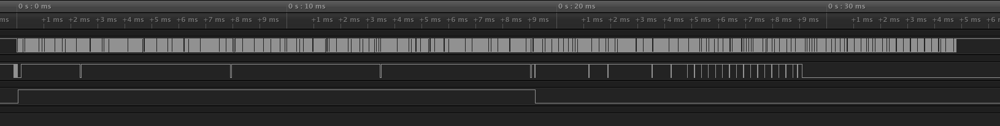
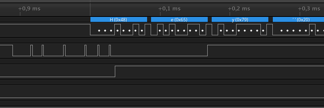
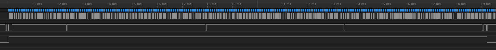

Передача данных по USART

	Канал 0 - USART_TX
	Канал 1 - debug_gpio_list[0] (__DBGPIO_USART_WAIT_AVAILABLE)
	Канал 2 - debug_gpio_list[1] (длительность dpn(wf))

на старте забивается буффер и начинается передача

три вызова dpn, каджый 2 раза дергает usart_tx, и того 6 коротких выполнений без блокирования, так как места в буфере достаточно

Далее вызывается dpn(wf) (канал 2), места в буффере не хватает, более того строка длинее буффера. потому мы ждем пока не освободится достаточное количество места в буфере. достаточное количество это остаток от деления длины строки на размер буфера. импульс 1 (самый короткий)

поэтому сначала ожидается меньшее время. далее остальной текст складывается в буффер кусками по 64 байта, 3 ожидания (2 3 4 одинаковой ширины), на конце 4го ожидания происходит загрузка последних 64 байт строки в буффер и дальше управление возвращается из функции usaart_tx, далее совсем короткая блокировка при вызове usart_tx для передачи \n\r